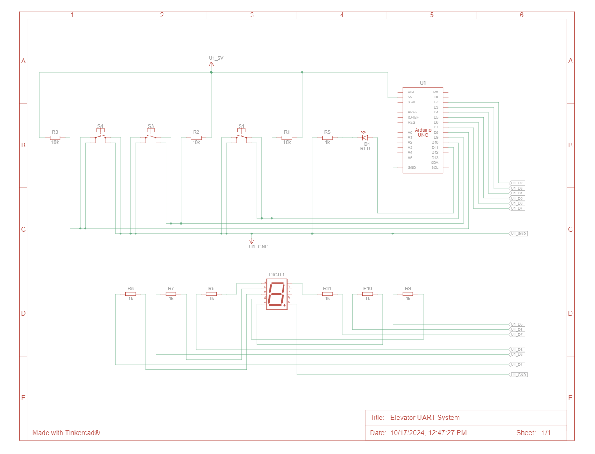

# Elevator-UART-Embedded
The purpose of this project is to design a UART-controlled embedded system to simulate an elevator, where various components like buttons, a 7-segment display, a buzzer, and an LED are integrated. The system allows manual control over the elevator’s functions, such as changing the floor display or responding to emergency button presses. The UART interface serves as the communication link for external commands, enabling precise control over system operations. This project not only highlights the use of UART in embedded systems but also models how manual approval can be used to ensure emergency procedures are properly handled

